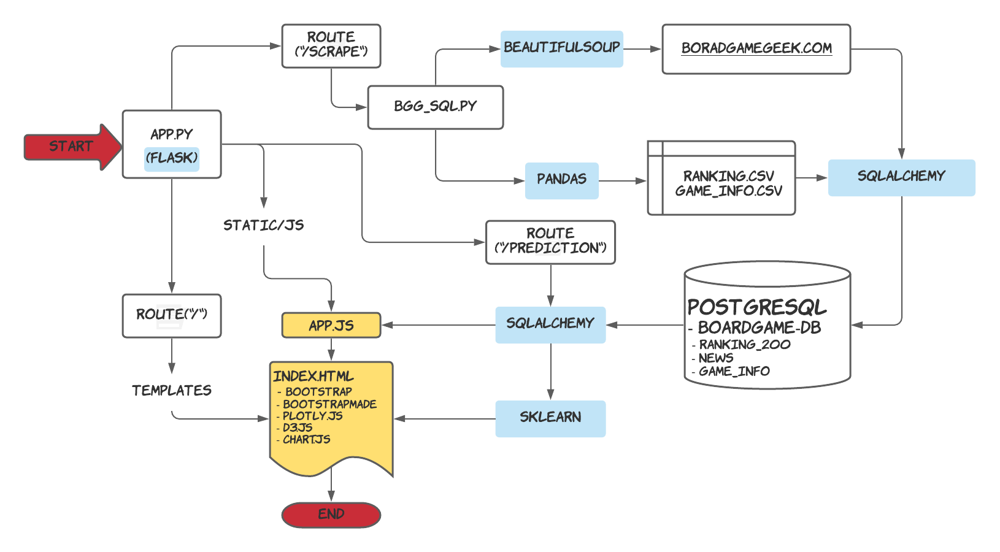

# Board Game Analysis

## Rationale

BoardGameGeek is a valuable resource for boardgame information. We built a webpage to visualize the data related to board games.  Using machine learning, we predict board game ratings based on 10 independent variables. 

## Dashboard

The index.html page will load with 

1. The latest Board Gaming News scrapped from boardgamegeek.com is loaded on a card on the right side of the HTML. It has the news title, image, link, and time information. Click the “Read More…” link to read the entire article.

2. The "scrape the news and load the data" button will scrape the load the most up-to-date data.

3. A user can choose a game from dropdown menu which consists games that made into the top 200 game list in the past 2.5 years. 

4. -  The game information board will load a brief description of the game, a minimum/maximum number of players, game link (functional), minimum ages of players, etc. 
   -  The game ranking over time is shown on a line plot. A red line shows the game is currently trending downward, while a green line shows it is trending upward.
   -  Based on the year of publishing of the selected game, the web page loads a bar graph with the top ten games with their average rankings. 
   -  The minimum age requirement and language dependence (out of 10) were plotted on a radar chart. 
   -  Finally, there is the bubble plot. It shows all the games published in the same year as the selected game. The x-axis represents the number of play counts from the website members, and the y-axis is the rating. A tooltip shows the game name, min playtime, and min number of players. The color of the bubble is based on the number of players (1,2,3-4,4+ => green, blue, yellow, red). The size of the bubble is based on the minimum playtime required.
   -  All columns of contents are responsive based on the size of the screen. The line graph will shift to second row on a medium screen size, and the news will be the fist row when user load the page on a mobile device.

   One has to install PostgreSQL to use this flask-driven web scrapping. A database called boardgame_db has to be created to communicate with the flask. After that is done, run the app.py file and load the page to your local server. The App.py has two routes, the scrape route calls bgg_scrape.py to get news from boardgamegeek.com and clean & changes the CSVs to load to PostgreSQL under database boradgame_db into three tables. The main route takes the data from the database and load to html with app.js to visualize and build the page.

## Exploratory data analysis (EDA)

To understand the data set and prepare it for ml, we did exploratory data analysis. We chose to highlight attributes in the categories of opinions, players, and game design here.

* Opinions: The more desirable a game, the higher the rating; but a rating of 9 or 10 is hard to achieve.
* Player: Not much variance with min number of players, the rating is going up with min age and min play time, but also maxed out at 7/8.
* Design: The dataset contains game published mostly in the past 50 years, the new games are having a higer rating compare to old ones. Higher rating games tends to have more mechanics and in multiple categories.

## Feature Selection

Features were selected based on correlations of independent variables. 

The top 10 features are the number of people wanting the game, number of views on the site, number of blogs regarding the game, minimum age requirement per the publishers, number of news articles on the game, number of podcasts on the game, the total number of the community votes, number of comments on the site on this game, number of geeks with the game on the list, number of weblinks for the game.

The feature importance was plotted in a pie plot using random forest regression.

## ML Models

The csv file contains 29,000+ board games, each has 50+ attributions. We cleaned the data by remove duplicates, null values, and invalid data. The data was then scaled by maxminscalar or standardscalar. We used 100% of the data to train. For each machine learning model, we create the GridSearchCV estimator along with a parameter object containing the values to adjust. The result is shown below.

- [sklearn.ensemble.RandomForestRegressor](https://scikit-learn.org/stable/modules/generated/sklearn.ensemble.RandomForestRegressor.html?highlight=regressor#sklearn.ensemble.RandomForestRegressor)  Explained Variance Score: 0.93451, R2 Score: 0.93450

- [sklearn.neural_network.MLPRegressor](https://scikit-learn.org/stable/modules/generated/sklearn.neural_network.MLPRegressor.html?highlight=regressor#sklearn.neural_network.MLPRegressor)  Explained Variance Score: 0.52960, R2 Score: 0.52941

- [sklearn.neighbors.KNeighborsRegressor](https://scikit-learn.org/stable/modules/generated/sklearn.neighbors.KNeighborsRegressor.html?highlight=regressor#sklearn.neighbors.KNeighborsRegressor) Explained Variance Score: 0.50760, R2 Score: 0.50689

- [sklearn.svm.SVC](https://scikit-learn.org/stable/modules/svm.html#regression) Explained Variance Score: 0.45471, R2 Score: 0.45446

- [sklearn.ensemble.AdaBoostRegressor](https://scikit-learn.org/stable/modules/generated/sklearn.ensemble.AdaBoostRegressor.html?highlight=regressor#sklearn.ensemble.AdaBoostRegressor) Explained Variance Score: 0.39258, R2 Score: 0.33835

- [sklearn.neighbors.RadiusNeighborsRegressor](https://scikit-learn.org/stable/modules/generated/sklearn.neighbors.RadiusNeighborsRegressor.html?highlight=regressor#sklearn.neighbors.RadiusNeighborsRegressor) bad fitting, wrong model

  

| **Regression** Score | metrics link                                                 |
| -------------------- | ------------------------------------------------------------ |
| ‘explained_variance’ | [`metrics.explained_variance_score`](https://scikit-learn.org/stable/modules/generated/sklearn.metrics.explained_variance_score.html#sklearn.metrics.explained_variance_score) |
| ‘r2’                 | [`metrics.r2_score`](https://scikit-learn.org/stable/modules/generated/sklearn.metrics.r2_score.html#sklearn.metrics.r2_score) |

## ML Prediction

The model predictions take 10 values from the form and gives results on the right.

## References

- BoardGameGeek.com
- Kaggle 20,000 Boardgames Dataset
- Kaggle Board Game Geek Rankings

## Future Work

Improve model accuracy by test train split and selection of features.

